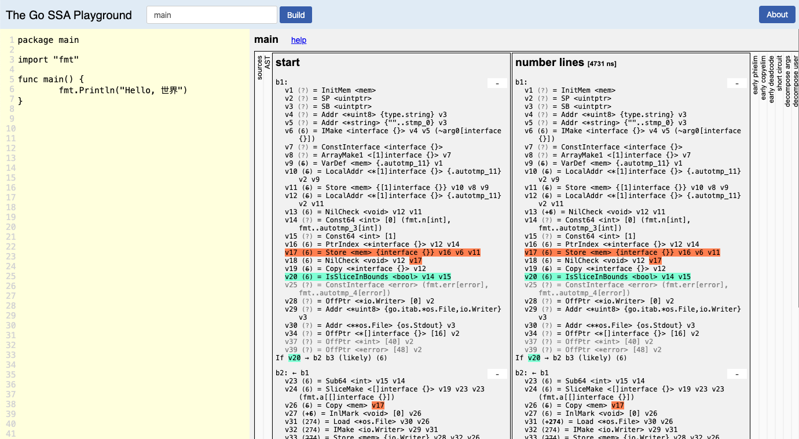

# The Go SSA Playground

https://golang.design/gossa

A tool for exploring Go's SSA intermediate representation.



## Deployment

There are two approaches to use the SSA Playground: native execution
or Docker-based deployment.

To execute natively, you can just use:

```bash
$ make
```

If you have Docker, then you can use:

```bash
$ make docker # build the docker image
$ make run    # run/update for latest image
```

Then access http://localhost:6789/gossa.

## Contribution

We would love to hear your feedback. Submit [an issue](https://github.com/golang-design/ssaplayground/issues/new) to tell bugs or feature requests.

## License

GNU GPLv3 &copy; [Changkun Ou](https://changkun.de)